# BlackwaterLeaf: Grafische Zielseiten

> **Zweck:** Diese Grafiken sind die verbindlichen visuellen Zielbilder für die Seiten, die sich **nach einem Tipp auf eine Auswahl** öffnen. Sie sind keine erneuten Startseiten: Jede Grafik zeigt ihren eigenen Hero, ihre Hauptaktionen und ihre eigene Akzentfarbe.

Die Komposition folgt dem bestätigten KI-Screen: Markenleiste, Sensorleiste, großer visueller Bereichs-Hero, vier bildbasierte Funktionskarten und die schwebende Bottom Navigation. Für eine Umsetzung in Web und App werden die vorhandenen Seitenfunktionen und Routen beibehalten; nur deren visuelle Darstellung wird entlang dieser Bildreferenzen angeglichen.

| Auswahl / Seite | Zielroute | Akzent | Grafik |
| --- | --- | --- | --- |
| **Botanik** | `/flow/botanik` → Pflanzenfunktion | Neon-Grün `#C7F35B` | [Botanik-Screen](screens/01-botanik.jpg) |
| **Aquaristik** | `/flow/aquaristik` → Aquarienfunktion | Neon-Blau `#28D8FF` | [Aquaristik-Screen](screens/02-aquaristik.jpg) |
| **Terraristik** | `/flow/terraristik` | Gelbgrün `#E1D661` | [Terraristik-Screen](screens/03-terraristik.jpg) |
| **KI-Assistent** | `/flow/ki-assistent` → `/ai` | Neon-Lila `#C36BFF` | [KI-Screen](screens/04-ki-assistent.jpg) |
| **Live-Bereich** | `/flow/live` | Neon-Blau `#28D8FF` | [Live-Screen](screens/05-live-bereich.jpg) |
| **Foto** | `/flow/foto` | Neon-Grün `#C7F35B` | [Foto-Screen](screens/06-foto.jpg) |
| **Beitrag** | `/flow/beitrag` → `/feed` | Blatt-Grün `#C7F35B` | [Beitrags-Screen](screens/07-beitrag.jpg) |
| **Entdecken** | `/explore` | Vier Bereichsfarben | [Entdecken-Screen](screens/08-entdecken.jpg) |
| **Community** | `/community` | Neon-Grün `#C7F35B` | [Community-Screen](screens/09-community.jpg) |
| **Profil** | `/profile` | Neon-Grün `#C7F35B` | [Profil-Screen](screens/10-profil.jpg) |
| **Wissen** | `/knowledge` | Neon-Grün `#C7F35B` | [Wissen-Screen](screens/11-wissen.jpg) |

## 1. Botanik – Seite nach dem Tippen

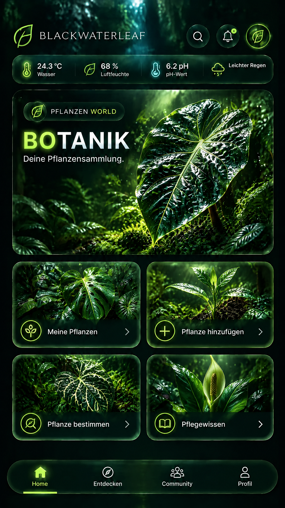

Die **Botanikseite** bündelt Sammlung, Anlage, KI-Bestimmung und Pflegewissen. Der große nasse Alocasia-Hero und die vier Themenkarten machen sofort deutlich, dass dies ein eigener Pflanzenbereich ist – nicht der Community-Feed.

## 2. Aquaristik – Seite nach dem Tippen

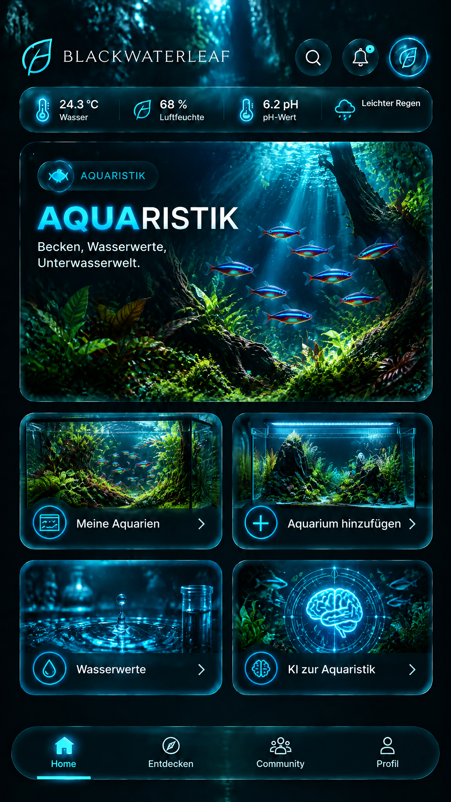

Die **Aquaristikseite** erhält den eigenen Unterwasserraum mit Kardinalsalmlern, Pflanzen, Beckenübersicht, Anlage, Wasserwerten und KI-Einstieg. Alle leuchtenden Konturen und Funktionsicons sind konsequent starkes Neonblau.

## 3. Terraristik – Seite nach dem Tippen

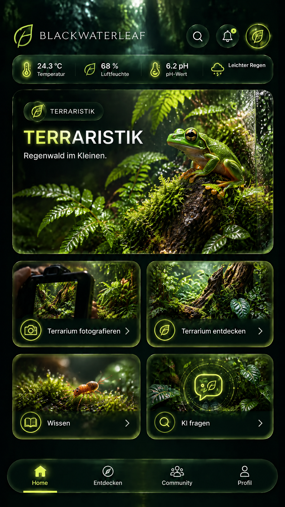

Die **Terraristikseite** übernimmt dieselbe Struktur, aber mit einem eigenständigen feuchten Regenwaldmotiv, Frosch-/Mooswelt und gelbgrüner Akzentfarbe. Sie ist somit visuell kein bloßes Duplikat der Pflanzenseite.

## 4. KI-Assistent – Seite nach dem Tippen

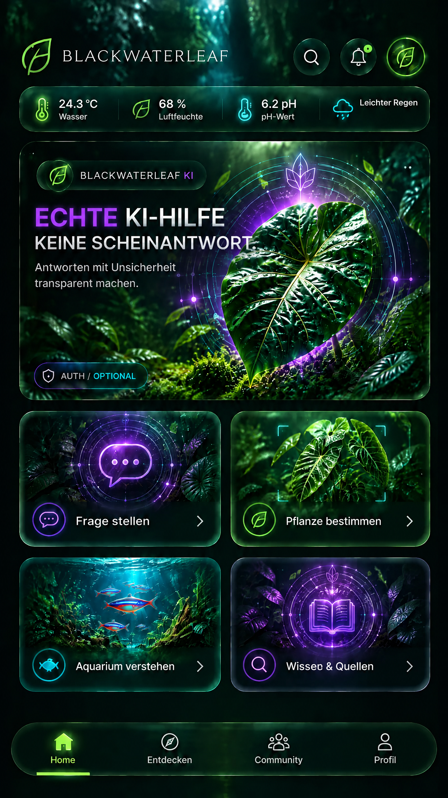

Die **KI-Seite** trägt bewusst den veröffentlichten Grundsatz „Echte KI-Hilfe. Keine Scheinantwort.“. Violette KI-Motive im botanischen Umfeld führen klar zu Frage, Bestimmung, Aquariumverständnis und Quellenwissen.

## 5. Live-Bereich – Seite nach dem Tippen

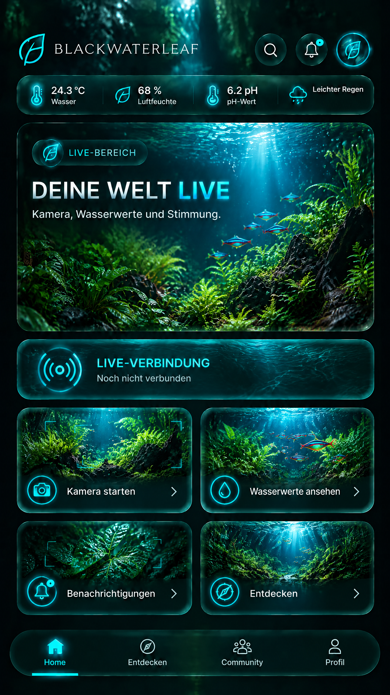

Die **Live-Seite** zeigt ihre eigene Live-Verbindungsfläche direkt zwischen Hero und den vier Aktionen. Der Status „Noch nicht verbunden“ darf so lange gezeigt werden, bis die reale Sensor- oder Kameraanbindung implementiert ist.

## 6. Foto – Seite nach dem Tippen

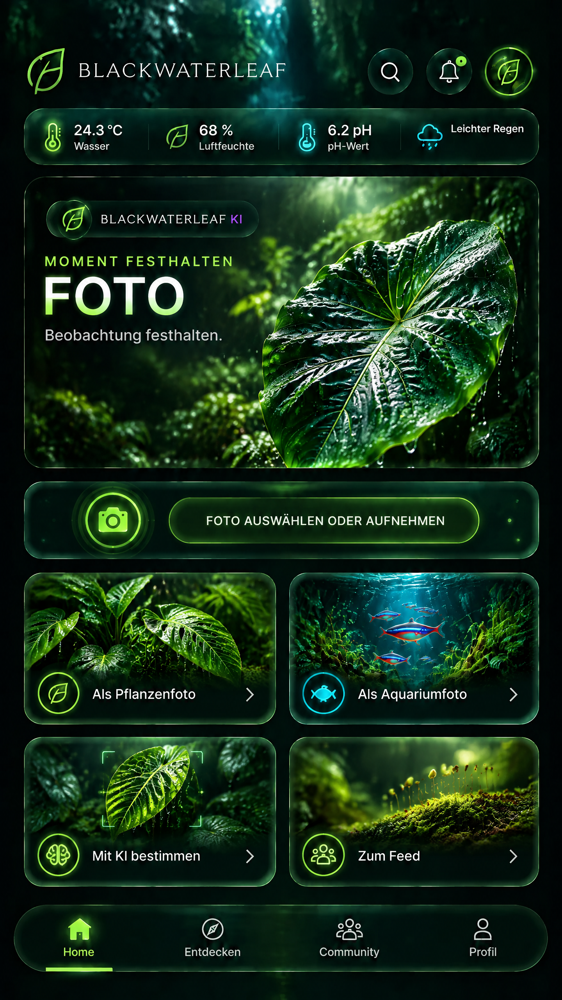

Die **Fotoseite** ist eine klare Aufnahme-Entscheidung: Der große Button zur Kamera-/Dateiauswahl steht vor den vier Zielwegen – Pflanzenfoto, Aquariumfoto, KI-Bestimmung oder Community-Feed.

## 7. Beitrag – Seite nach dem Tippen

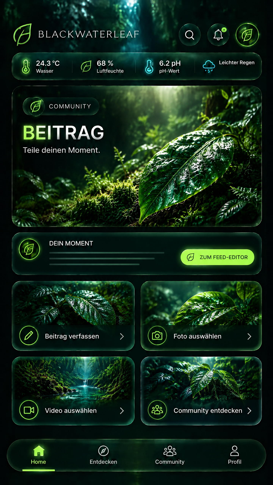

Die **Beitragsseite** führt in den Feed-Editor. Ihr eigener Hero, Composer-Vorschau und die vier nachgelagerten Optionen verhindern, dass der Beitragsweg wie ein generischer Dialog wirkt.

## 8. Entdecken – veröffentlichte Hauptseite

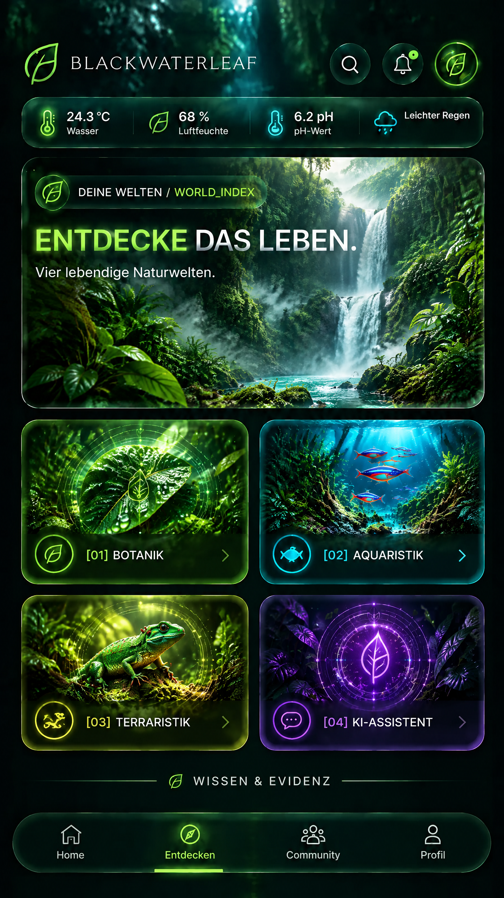

Die veröffentlichte Route `/explore` führt in den World Index. Der Bildschirm macht die vier tatsächlich angebotenen Welten sichtbar: Botanik, Aquaristik, Terraristik und KI-Assistent. Der Home-Screen ist bereits durch `reference-screenshot.jpg` abgedeckt; diese Grafik ist die Zielansicht **nach** dem Tippen auf „Entdecken“.

## 9. Community – veröffentlichte Hauptseite

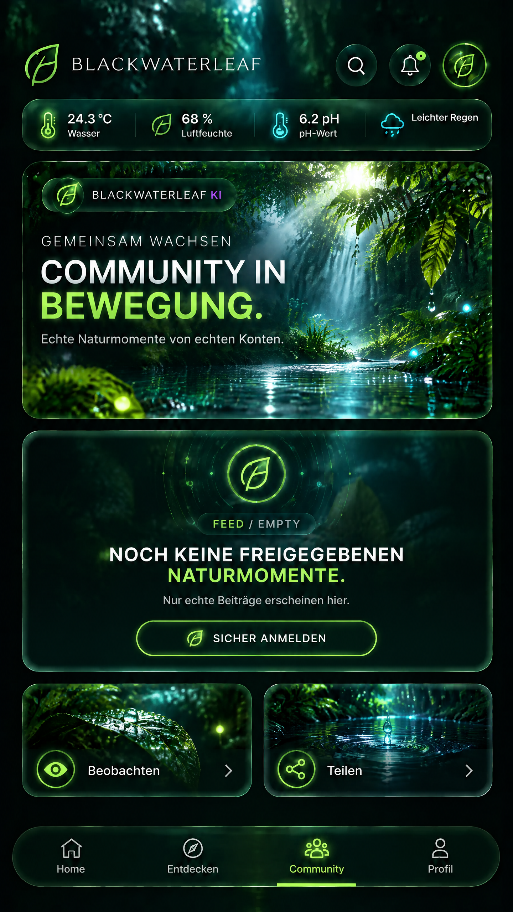

Die veröffentlichte Route `/community` zeigt derzeit nur echte, freigegebene Beiträge. Deshalb visualisiert der Screen konsequent den **leeren Feed-Zustand** und erfindet keine Mitglieder, Likes, Kommentare oder Beiträge. Das ist der unmittelbare Zielscreen nach dem Tippen auf „Community“.

## 10. Profil – veröffentlichte Hauptseite

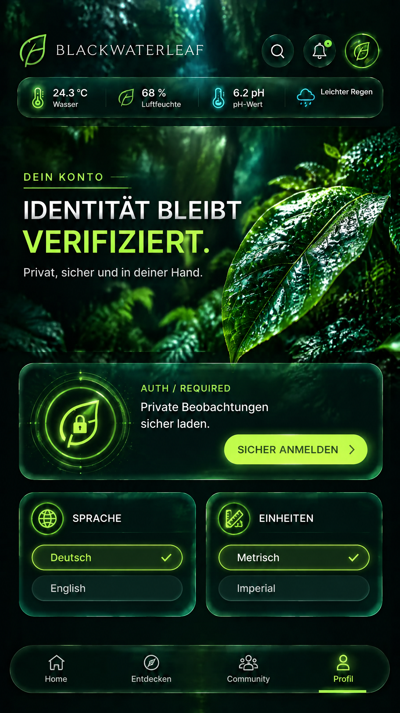

Die veröffentlichte Route `/profile` verlangt für private Beobachtungen eine sichere Anmeldung und enthält Sprache sowie Einheiten. Der Screen zeigt genau diese drei vorhandenen Funktionen im Overlay-Design, ohne ein falsches Benutzerprofil zu erfinden.

## 11. Wissen – veröffentlichte Hauptseite

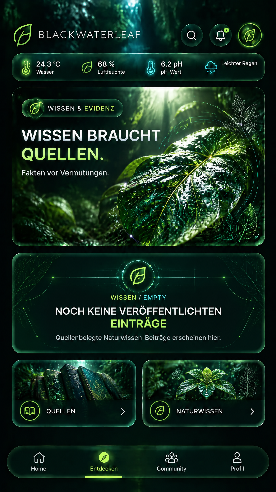

Die veröffentlichte Route `/knowledge` kommuniziert aktuell, dass noch keine quellenbelegten Wissenseinträge veröffentlicht sind. Die Grafik gibt diesem ehrlichen Leerzustand eine hochwertige, klar als Wissen erkennbare Zieloberfläche.

## Umsetzungsregel

Beim Implementieren zählt der **Bildaufbau**: Die obere Marken- und Sensorzone bleibt konstant; Bildwelt, Neonfarbe, Titel, Hero und vier Funktionskarten wechseln pro Bereich. Keine neue Icon-Sammlung und keine austauschbaren, textlastigen Dashboard-Karten erzeugen. Jede Karte muss zu einer vorhandenen Funktion oder zu einer ausdrücklich als zukünftige Funktion markierten Seite führen. Leerzustände der veröffentlichten Community-, Profil- und Wissensseiten bleiben transparent; keine Inhalte, Personen oder Messwerte erfinden.
