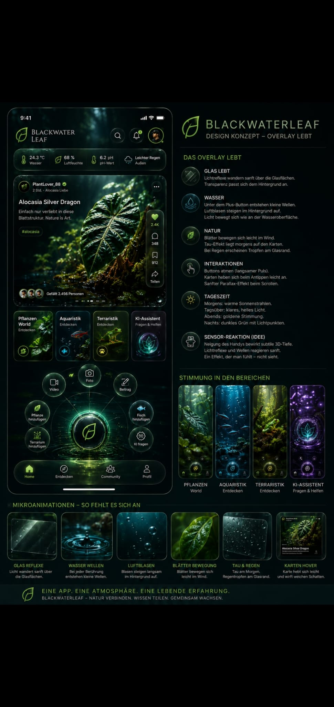

# BlackwaterLeaf: Design-Übergabe „Overlay lebt“

> **Zweck:** Diese Übergabe macht das vom Auftraggeber bereitgestellte Referenzlayout als funktionsfähige, responsive React-Referenz in der bestehenden `Blackwaterleaf/blackwaterleaf`-PWA verfügbar. Die Zielansicht ist auf dem Branch `design/reference-overlay-layout` unter `/design-reference` abrufbar.



## Implementierungsstand

Die neue Seite [`client/src/pages/DesignReference.tsx`](../../client/src/pages/DesignReference.tsx) reproduziert die zentrale Komposition der Vorlage: ein lebendes Smartphone-Interface links und die detaillierte Design-Spezifikation rechts. Unterhalb von 780 px wird die Ansicht zu einer mobilen Einspalten-Komposition. Die Styles liegen vollständig getrennt in [`client/src/styles/reference-layout.css`](../../client/src/styles/reference-layout.css). Der Aufruf ist in [`client/src/App.tsx`](../../client/src/App.tsx) als Route `/design-reference` registriert.

Die Referenz verwendet vier eigens für diese Übergabe erzeugte, stimmige Naturmotive. Die lokalen Originale liegen versioniert unter `docs/design/assets/`; die laufende Referenz bindet sie über stabile Manus-CDN-URLs ein, damit sie auch außerhalb der bisherigen Deployment-Umgebung sichtbar sind. Sie führt keine neuen Backend-Abhängigkeiten ein und verändert keine Datenmodelle, Authentifizierung oder bestehenden Benutzerflüsse.

## Verbindliche visuelle Regeln

| Bereich | Regel | Umsetzung in der Referenz |
| --- | --- | --- |
| **Farbwelt** | Fast schwarzes Tannengrün als Basis; gelbgrüne Blatt-Akzente statt reinem „App-Grün“. | `#030807`, `#07110e`, Blatt-Akzent `#b7d65b` bis `#d2ec70`. |
| **Oberflächen** | Karten und Navigation sind dunkle, halbtransparente Glasflächen mit feiner, heller Kontur. | Transparente `rgba()`-Flächen, `backdrop-filter`, 1-px-Ränder und dezente Inset-Highlights. |
| **Typografie** | Großes, technisch-elegantes Letterspaced-Branding; Informationshierarchie über Kontrast und Kleinschrift. | Inter; Markenwort in Großbuchstaben mit großzügigem Letterspacing. |
| **Homepage** | Kopfbereich, Sensorleiste, Hero-Post, vier Themenwelten, zentrales Radialmenü und Bottom Navigation. | Vollständig in `DesignReference.tsx` als mobile Referenz umgesetzt. |
| **Bereichsfarben** | Botanik = gelbgrün; Aquaristik = Cyan; Terraristik = warmes Gelbgrün; KI = Violett. | Jede Themenkarte hat eigenen Akzent und Bildstimmung. |
| **Mikrointeraktionen** | Glasreflexe, Wasserwellen, schwebende Blasen, Blattbewegung und Karten-Hover sind zurückhaltend. | CSS-Animationen mit `prefers-reduced-motion`-Fallback. |

### Interaktive Bereichsfarben und Icons

Die Auswahlbuttons verwenden keine generischen Bildsymbole. Sie sind als skalierbare, interaktive Lucide-Vektor-Icons mit den verbindlichen Neonfarben aus der Vorlage implementiert. **Botanik** erhält `#C7F35B`, **Aquaristik** das starke Neonblau `#28D8FF`, **Terraristik** das warme Gelbgrün `#E1D661` und der **KI-Assistent** Neonlila `#C36BFF`. Die Komponenten `WorldSelector.tsx` und `QuickActionWheel.tsx` enthalten die Routen, Tastaturfokusse und Touch-Interaktionen für die Wahlkarten bzw. das zentrale Aktionsrad; `world-controls.css` definiert alle Farben, Glaseffekte und Bewegungen.

## Architekturentscheidung

Die bestehende Repository-Codebasis ist eine React-/TypeScript-PWA. Sie wird sowohl im Browser als auch auf mobilen Geräten ausgeliefert und enthält bereits ein Android-APK-Download-Angebot. Deshalb wurde die Gestaltung in dieser Codebasis implementiert, anstatt das separate Repository `Blackwaterleaf/blackwaterleaf-studio` zu verändern: Dessen Expo-Client gehört laut eigener README zu **BlackWaterLeaf Studio** und nicht zur Natur-/Community-App.

Der neue Referenzscreen ist bewusst isoliert. Dadurch kann die laufende App unverändert bleiben, während das Zielbild ohne Risiko getestet und in einzelnen Schritten auf `AppLayout`, `BottomNav`, `Feed`, `Discover`, `Plants`, `Aquariums` und `AiAssistant` übertragen wird.

## Empfohlene Integrationsreihenfolge

1. Die globalen Farben und Bewegungsprinzipien aus `reference-layout.css` in `client/src/index.css` als Design-Tokens überführen. Bestehende kontrastreiche Markenaktionen dürfen den Blatt-Akzent verwenden; keine flächigen, hellen Grüntöne einführen.
2. `AppLayout.tsx` und `BottomNav.tsx` in der bestehenden PWA an die Telefonkopfzeile und die fünf Tabs der Referenz angleichen. Dabei Routen, `useAuth` und den funktionierenden Radial-Workflow erhalten.
3. `Feed.tsx` wie den zentralen Bildpost der Referenz gestalten: stärkeres Bild, dunkle Vignette, kompakter Meta-Header und vertikale Schnellaktionen auf Mobilgeräten. Reale Posts und tRPC-Aufrufe dürfen niemals durch statische Beispieldaten ersetzt werden.
4. Die vier Themenbereiche (`Plants`, `Aquariums`, Terrarium-/Discover-Einstieg und `AiAssistant`) nach ihren eigenen Stimmungen aufbauen. Für den aktuell fehlenden eigenen Terrarium-Bereich soll zunächst die Discover-Route verwendet werden; keine nicht existierende Route verlinken.
5. Desktop: Die Seiten behalten einen stabilen, maximal etwa 1400 px breiten Inhaltsbereich. Die Informationsspalte der Referenz wird als sinnvolle Desktop-Seitenleiste, nicht als zweites Smartphone, interpretiert.
6. Zum Abschluss die Route `/design-reference` als Referenz im Repo lassen, bis der Auftraggeber die vollständige Übernahme bestätigt. Sie ist ein prüfbarer visueller Vertrag für spätere Chats und Entwickler.

## Übergabeprompt für den nächsten Chat

```text
Arbeite im Repository Blackwaterleaf/blackwaterleaf auf dem Branch design/reference-overlay-layout.

Die verbindliche visuelle Quelle ist docs/design/reference-screenshot.jpg. Eine bereits funktionsfähige, responsive Umsetzung der Zielästhetik liegt unter der Route /design-reference in client/src/pages/DesignReference.tsx und client/src/styles/reference-layout.css. Lies zuerst docs/design/REFERENCE_OVERLAY_HANDOFF.md.

Übertrage dieses Design schrittweise auf die produktiven PWA-Seiten und Komponenten, ohne tRPC-Datenzugriffe, Authentifizierung, Routen, den APK-Download oder bestehende Funktionsabläufe zu beschädigen. Nutze nur echte Daten in produktiven Komponenten. Baue und prüfe danach TypeScript und den Vite-Build. Committe ausschließlich kohärente, getestete Änderungen auf diesem Branch.
```

## Abnahmekriterien für die nächste Umsetzung

| Prüfung | Erwartung |
| --- | --- |
| Mobilansicht | Das Interface wirkt wie die linke Smartphoneansicht der Designquelle: dunkles organisches Overlay, Sensorleiste, Bildpost, Welten, leuchtender Mittelpunkt und Bottom Navigation. |
| Desktopansicht | Die Inhaltsbreite, Glasflächen und Informationshierarchie übernehmen die rechte Spezifikationsseite ohne unbrauchbar kleine Touch-Ziele. |
| Funktion | Navigation, Login, Posting, Feed-Filter, Likes, Kommentare und Schnellaktionen bleiben mit ihren aktuellen Routen bzw. tRPC-Mutationen verbunden. |
| Zugänglichkeit | Fokuszustände, Bild-Alternativtexte und die Deaktivierung nicht essenzieller Bewegung bei `prefers-reduced-motion` bleiben erhalten. |
| Build | `pnpm check` und `pnpm build` laufen ohne Fehler. |

## Dateien dieses Branches

| Datei | Rolle |
| --- | --- |
| `docs/design/reference-screenshot.jpg` | Unveränderte, vom Auftraggeber bereitgestellte Vorlage. |
| `docs/design/assets/` | Vier versionierte, stimmige Originalmotive für Pflanze, Aquarium, Terrarium und KI-Assistent. |
| `docs/design/REFERENCE_OVERLAY_HANDOFF.md` | Dieser Implementierungsauftrag und Übergabe-Prompt. |
| `client/src/pages/DesignReference.tsx` | Funktionsfähige React-Referenzroute. |
| `client/src/styles/reference-layout.css` | Isolierte Stil-, Responsive- und Animationsdefinitionen. |
| `client/src/components/WorldSelector.tsx` | Vier funktionsfähige Themen-Wahltasten mit Neonfarben und Zielrouten. |
| `client/src/components/QuickActionWheel.tsx` | Zentrales, aufklappbares Schnellaktionsrad mit sieben Wähltasten. |
| `client/src/styles/world-controls.css` | Produktionsreife Farben, Icon-, Karten- und Radstile für die Auswahlkomponenten. |
| `client/src/App.tsx` | Registriert die Preview unter `/design-reference`. |
